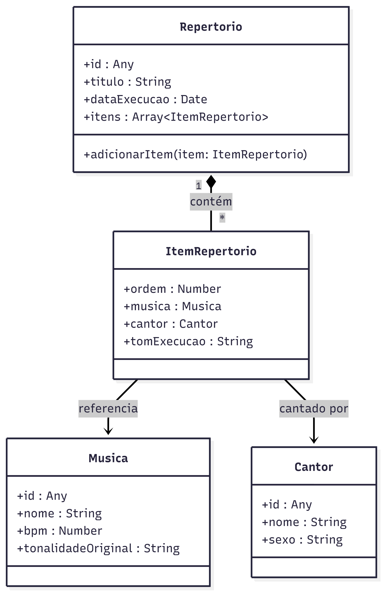

# Music Hub

## Descrição do Projeto

O Music Hub é uma plataforma desenvolvida para otimizar a gestão de grandes repertórios musicais e suas respectivas variações de tonalidades. O sistema foi projetado para simplificar o planejamento de cultos e eventos religiosos, permitindo que a escolha das músicas seja alinhada dinamicamente com a equipe de vocalistas escalada para cada ocasião.

## Funcionalidades

### 1. Gestão de Músicas

Permite o armazenamento estruturado do catálogo musical da instituição, contemplando as seguintes informações:

- **Nome:** Título da canção.
- **Versão:** Identificação do arranjo ou ministério de origem.
- **Link de Referência:** Ligação direta para a plataforma YouTube para facilitar os ensaios.
- **BPM (Batimentos por Minuto):** Definição do tempo da música para alinhamento com a equipe instrumental.

### 2. Cadastro de Cantores

Mapeamento dos integrantes do ministério de louvor com foco nos critérios de escala:

- **Nome:** Identificação do integrante.
- **Idade:** Informação demográfica para controle interno.
- **Sexo:** Critério para a organização de naipes vocais e definição de tonalidades adequadas.

### 3. Planejamento de Repertórios

Módulo para a criação e organização de escalas de eventos:

- Criação de repertórios específicos associados a datas ou cultos determinados.
- Seleção de músicas baseada diretamente na disponibilidade e na composição dos cantores escalados para a ocasião.

## Estrutura das Classes do Projeto

A arquitetura do sistema baseia-se na separação das entidades fundamentais e de seu contexto de execução. Abaixo está a representação da estrutura principal de dados, implementada em JavaScript:



### Musica

Representa uma música no catálogo geral.

- **id:** O identificador único da música no banco de dados.
- **nome:** O título da canção.
- **bpm:** Os batimentos por minuto (andamento) da música.
- **tonalidadeOriginal:** O tom original da gravação ou versão base.

```javascript
class Musica {
  constructor(id, nome, bpm, tonalidadeOriginal) {
    this.id = id;
    this.nome = nome;
    this.bpm = bpm;
    this.tonalidadeOriginal = tonalidadeOriginal;
  }
}
```

### Cantor

Representa um integrante da equipe de vocalistas.

- **id:** O identificador único do cantor no banco de dados.
- **nome:** O nome do integrante.
- **sexo:** O gênero do cantor, utilizado para auxiliar na definição de tonalidades adequadas.

```javascript
class Cantor {
  constructor(id, nome, sexo) {
    this.id = id;
    this.nome = nome;
    this.sexo = sexo;
  }
}
```

### ItemRepertorio

Representa a associação de uma música a um cantor para um momento específico do evento.

- **ordem:** A posição em que a música será executada na setlist (ex: 1 para a primeira).
- **musica:** A instância da classe Musica que será tocada.
- **cantor:** A instância da classe Cantor que liderará a música.
- **tomExecucao:** A tonalidade exata que os instrumentistas devem tocar nesta ocasião.

```javascript
class ItemRepertorio {
  constructor(ordem, musica, cantor, tomExecucao) {
    this.ordem = ordem;
    this.musica = musica;
    this.cantor = cantor;
    this.tomExecucao = tomExecucao;
  }
}
```

### Repertorio

Agrupa a lista de músicas, definindo a setlist de um evento ou culto específico.

- **id:** O identificador único do repertório.
- **titulo:** O nome ou descrição do evento (ex: "Culto de Domingo").
- **dataExecucao:** A data programada para a execução do repertório.
- **itens:** A lista que armazena os itens de repertório desta escala.
- **adicionarItem(item):** Método que adiciona um novo item à setlist e mantém a lista ordenada cronologicamente baseada na ordem de execução.

```javascript
class Repertorio {
  constructor(id, titulo, dataExecucao) {
    this.id = id;
    this.titulo = titulo;
    this.dataExecucao = dataExecucao;
    this.itens = [];
  }

  adicionarItem(item) {
    this.itens.push(item);
    this.itens.sort((a, b) => a.ordem - b.ordem);
  }
}
```

### Arquitetura

- SQLite
- JavaScript + Express
- JavaScript + Bootstrap
