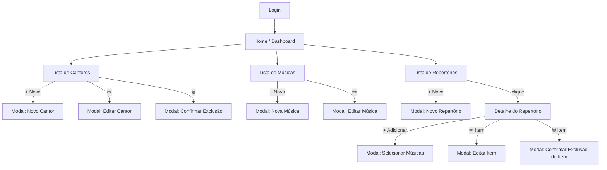

# M-hub — Análise do Código Real + Proposta de UX/UI

> **Stack atual**: Node.js + Express + SQLite (better-sqlite3) | Vanilla JS + Bootstrap 5  
> **Entidades**: Cantor · Música · Repertório · Item de Repertório  
> **Referência visual proposta**: Spotify — tema claro e escuro

---

## 1. Análise da Lógica Atual (O que existe hoje)

### 1.1 Backend — O que está bem feito ✅

A arquitetura do servidor está bem organizada em camadas:

| Camada | Arquivos | Função |
|--------|----------|--------|
| **Routes** | `cantorRoutes.js`, `musicaRoutes.js`, etc. | Mapeiam URLs para controllers |
| **Controllers** | `cantorController.js`, `musicaController.js`, etc. | Recebem req/res, chamam services |
| **Services** | `cantorService.js`, `musicaService.js`, etc. | Regras de negócio |
| **Models** | `cantor.js`, `musica.js`, etc. | Queries SQLite |

As 4 entidades têm CRUD completo via API REST:

- `GET/POST /api/musicas` · `PUT/DELETE /api/musicas/:id`
- `GET/POST /api/cantores` · `PUT/DELETE /api/cantores/:id`
- `GET/POST /api/repertorios` · `PUT/DELETE /api/repertorios/:id`
- `GET/POST /api/itens-repertorio` · `PUT/DELETE /api/itens-repertorio/:id`
- `GET /api/itens-repertorio/repertorio/:repId` ← endpoint especial por repertório ✅

O modelo de **Item de Repertório** suporta:
- `ordem` (integer) — já existe!
- `tomExecucao` — tom específico para a execução (diferente do tom original da música)
- `cantorId` — cantor que canta aquela música naquele repertório
- `listarPorRepertorio()` — já ordena por `ordem ASC`

### 1.2 Backend — Problemas identificados ⚠️

1. **Login sem JWT**: O `/login` retorna o objeto do usuário sem token. Qualquer rota da API é acessível sem autenticação — não há middleware de auth nas rotas de dados.
2. **Usuários em memória**: O array `usuarios` no `app.js` se perde ao reiniciar o servidor. Usuários deveriam estar no SQLite como as outras entidades.
3. **CORS totalmente aberto**: `app.use(cors())` sem restrição de origem.
4. **Sem paginação**: `SELECT * FROM cantores` retorna todos os registros de uma vez.
5. **Senha em texto puro**: A senha é comparada como string simples, sem hash (bcrypt).
6. **Sem endpoint de dashboard**: A home precisa fazer 3 requests separados para obter as contagens.

### 1.3 Frontend — O que está bem feito ✅

- Arquitetura modular com ES Modules: `api.js` → `services/` → `ui/` ← `main.js`
- Camada `api.js` centralizada e reutilizável
- Tratamento de erros com `try/catch` e exibição via `#alerta`
- Separação clara entre lógica (services) e apresentação (views)
- `itemRepertorioView` mantém mapa `nomePorMusicaId` e `nomePorCantorId` para exibição

### 1.4 Frontend — Problemas identificados ⚠️

1. **Single Page sem roteamento**: Tudo numa única tela (`index.html`), com os 4 formulários e 4 listas exibidos simultaneamente. Isso é o maior problema de usabilidade — o usuário vê tudo de uma vez e fica confuso.
2. **Formulários no topo das listas**: O usuário precisa preencher o formulário acima da lista para criar um item. O fluxo deveria ser: "ver lista → clicar em adicionar → preencher modal → fechar".
3. **Edição inline sempre visível**: Todo item da lista já mostra o campo de edição permanentemente, tornando a lista visualmente poluída.
4. **Sem confirmação de exclusão**: Clicar em "Remover" deleta imediatamente sem perguntar.
5. **Sem feedback visual de carregamento**: As chamadas de API não mostram estado de loading.
6. **Sem tela de login integrada**: O frontend não tem tela de login — abre direto no painel.
7. **Bug em `musicaView.js` linha 26**: `input.value = musica.tom` — o campo correto é `musica.tonalidadeOriginal` (nome do campo no backend é `tonalidade_original`).

---

## 2. Proposta de UX/UI — Como Deveria Ser

### 2.1 Princípio Central: Uma coisa por vez

O problema raiz da UI atual é **informação demais na mesma tela**. A proposta é:

> **Tela de login → Dashboard → Tela dedicada por entidade → Detalhe por entidade**

---

## 3. Paleta de Cores — Inspirada no Spotify

### Tema Escuro (padrão)
| Token | Hex | Uso |
|-------|-----|-----|
| `--bg-base` | `#121212` | Fundo da página |
| `--bg-elevated` | `#1E1E1E` | Cards, sidebar, modais |
| `--bg-highlight` | `#2A2A2A` | Hover em linhas/cards |
| `--accent` | `#1DB954` | Verde Spotify — botões primários, badges, ativo |
| `--accent-hover` | `#1ED760` | Hover do botão primário |
| `--text-primary` | `#FFFFFF` | Títulos, texto principal |
| `--text-muted` | `#B3B3B3` | Subtítulos, metadados, placeholders |
| `--border` | `#303030` | Bordas de cards, inputs, divisores |
| `--danger` | `#E57373` | Botões de deletar, erros |

### Tema Claro
| Token | Hex | Uso |
|-------|-----|-----|
| `--bg-base` | `#FFFFFF` | Fundo da página |
| `--bg-elevated` | `#F4F4F4` | Cards, sidebar |
| `--bg-highlight` | `#E8E8E8` | Hover |
| `--accent` | `#1DB954` | Verde Spotify |
| `--accent-hover` | `#158F3E` | Hover escurecido |
| `--text-primary` | `#121212` | Títulos |
| `--text-muted` | `#535353` | Subtítulos |
| `--border` | `#DEDEDE` | Bordas |
| `--danger` | `#C0392B` | Deletar, erros |

### Tipografia
- **Fonte**: Inter (Google Fonts) — próximo do Circular usado pelo Spotify
- H1: 28px Bold | H2: 22px SemiBold | Body: 14px Regular | Caption: 12px Muted

---

## 4. Componentes Globais

### 4.1 Layout Principal
```
┌──────────────────────────────────────────────────────┐
│ SIDEBAR (240px)  │  TOPBAR                           │
│                  ├──────────────────────────────────  │
│                  │                                   │
│                  │      ÁREA DE CONTEÚDO             │
│                  │                                   │
└──────────────────────────────────────────────────────┘
```

### 4.2 Sidebar (fixa à esquerda)
```
┌──────────────────┐
│  🎵  M-hub       │  ← logo
├──────────────────┤
│▌ 🏠  Dashboard   │  ← item ativo (barra verde 3px)
│  🎤  Cantores    │
│  🎵  Músicas     │
│  📋  Repertórios │
├──────────────────┤
│  ── ── ── ──     │
│  ☀️/🌙 Tema     │  toggle dark/light
│  👤  Ana Silva   │  nome do usuário logado
│  🚪  Sair        │
└──────────────────┘
```
- Item ativo: borda esquerda `3px solid --accent`, texto branco
- Item inativo: texto `--text-muted`, hover fundo `--bg-highlight`
- Mobile (< 768px): vira bottom bar com 4 ícones

### 4.3 Topbar
```
[← →]  Dashboard                      [🔍 Buscar...]
```
- Navegação de histórico (back/forward como browser)
- Título dinâmico da seção
- Campo de busca global (cantores + músicas + repertórios)

### 4.4 Modal Padrão
```
┌─────────────────────────────────────┐
│  Título do Modal                ✕   │
│  ──────────────────────────────     │
│  [campos do formulário]             │
│                                     │
│              [Cancelar] [Salvar →]  │
└─────────────────────────────────────┘
```
- ESC fecha o modal
- Clique fora do card fecha o modal
- Botão Salvar fica desabilitado enquanto campos obrigatórios estão vazios

### 4.5 Toast de Feedback
- Canto inferior direito, 3 segundos, fade-out
- ✅ Verde para sucesso: "Cantor salvo com sucesso"
- ❌ Vermelho para erro: "Erro ao conectar com a API"

### 4.6 Modal de Confirmação de Exclusão
```
┌─────────────────────────────────────┐
│  🗑️ Remover cantor?                │
│                                     │
│  Isso não pode ser desfeito.        │
│                                     │
│          [Cancelar] [Remover]       │
└─────────────────────────────────────┘
```

---

## 5. Tela de Login

### Descrição Visual
- **Fundo**: `#121212` com gradiente radial verde `rgba(29,185,84,0.06)` do centro
- **Card centralizado**: `--bg-elevated`, border-radius 16px, sombra `0 8px 32px rgba(0,0,0,0.5)`
- **Logo**: ícone de nota musical (🎵 SVG) + texto bold "M-hub" em `--accent`
- **Inputs**: borda `--border`, foco → borda `--accent` com glow `rgba(29,185,84,0.3)`
- **Botão Entrar**: full-width, `--accent`, texto branco, rounded-full, spinner ao submeter

```
┌──────────────────────────────────────────┐
│                                          │
│          🎵  M-hub                       │
│                                          │
│  ┌────────────────────────────────────┐  │
│  │    Bem-vindo de volta 👋           │  │
│  │    Gerencie seu repertório         │  │
│  │                                    │  │
│  │  [✉  Email ou usuário           ]  │  │
│  │  [🔒 Senha               👁    ]  │  │
│  │                                    │  │
│  │  [         ENTRAR →              ] │  │
│  │                                    │  │
│  │   Esqueceu a senha?                │  │
│  └────────────────────────────────────┘  │
│                                          │
└──────────────────────────────────────────┘
```

### Comportamento
- Campo de senha com toggle mostrar/ocultar (👁)
- Tecla Enter no campo de senha submete o formulário
- Ao submeter: botão vira spinner, inputs ficam desabilitados
- Erro: banner vermelho acima dos campos com a mensagem da API
- Se token válido em `localStorage` → redireciona direto para a Home

---

## 6. Tela Home / Dashboard

```
┌──────────┬──────────────────────────────────────────────────────┐
│ SIDEBAR  │  ← →  Dashboard           🔍 Buscar...              │
│          ├──────────────────────────────────────────────────────┤
│ 🏠 Home  │                                                      │
│ 🎤 Cant. │  Olá, Ana! 👋                                        │
│ 🎵 Mús.  │  Aqui está um resumo do seu hub musical              │
│ 📋 Rep.  │                                                      │
│          │  ┌────────────┐  ┌────────────┐  ┌────────────┐      │
│ ────────  │  │     12     │  │     48     │  │     6      │      │
│ ☀️ Tema  │  │  Cantores  │  │  Músicas   │  │ Repertórios│      │
│ 👤 Ana   │  └────────────┘  └────────────┘  └────────────┘      │
│ 🚪 Sair  │                                                      │
│          │  📋 Repertórios Recentes              [Ver todos →]  │
│          │  ┌──────────────────────────────────────────────┐    │
│          │  │ 🎼  Show de Natal       12 músicas      →    │    │
│          │  │ 🎼  Casamento Silva      8 músicas      →    │    │
│          │  │ 🎼  Culto de Domingo    15 músicas      →    │    │
│          │  └──────────────────────────────────────────────┘    │
│          │                                                      │
│          │  🎤 Cantores em Destaque            [Ver todos →]    │
│          │  ┌──────┐  ┌──────┐  ┌──────┐  ┌──────┐             │
│          │  │  A   │  │  J   │  │  M   │  │  +   │             │
│          │  │ Ana  │  │ João │  │Maria │  │Todos │             │
│          │  └──────┘  └──────┘  └──────┘  └──────┘             │
└──────────┴──────────────────────────────────────────────────────┘
```

### KPI Cards
- 3 cards iguais, lado a lado (1/3 da largura cada)
- Número grande animado (count-up de 0 ao valor real)
- Clicável → navega para a lista correspondente
- Hover: sombra mais pronunciada + leve elevação

### Repertórios Recentes
- Lista dos últimos 5 repertórios por `criada_em DESC`
- Linha: ícone + nome + badge "X músicas" + seta →
- Hover: fundo `--bg-highlight`
- Clique: navega para o detalhe do repertório

### Cantores em Destaque
- Grid horizontal (carrossel com scroll)
- Avatar circular: inicial do nome em fundo `--accent` se sem foto
- Mobile: scroll horizontal com swipe

---

## 7. Tela de Cantores

```
┌──────────────────────────────────────────────────────────┐
│  🎤 Cantores                          [+ Novo Cantor]    │
│  ────────────────────────────────────────────────────    │
│  🔍 Buscar cantor...                                     │
│                                                          │
│  ┌────────────────────────────────────────────────────┐  │
│  │  [A]  Ana Carolina        Feminino     🖊  🗑      │  │
│  │  [J]  João Paulo          Masculino    🖊  🗑      │  │
│  │  [M]  Maria Bethânia      Feminino     🖊  🗑      │  │
│  └────────────────────────────────────────────────────┘  │
│                                          < 1 2 3 >       │
└──────────────────────────────────────────────────────────┘
```

### Comportamento
- Avatar circular com inicial + cor `--accent` (sem foto por ora)
- Ícones de ação (✏️ 🗑️) só aparecem no hover da linha
- 🖊 → abre modal de edição preenchido
- 🗑️ → abre modal de confirmação de exclusão
- Busca filtra em tempo real (debounce 300ms)
- Empty state: "🎤 Nenhum cantor ainda. [+ Adicionar primeiro cantor]"

### Modal Novo/Editar Cantor
```
┌──────────────────────────────────────┐
│  Novo Cantor                    ✕    │
│  ────────────────────────────────    │
│  Nome *       [                   ] │
│  Sexo         [  Masculino / Feminino  ▾] │
│                                      │
│             [Cancelar]  [Salvar →]   │
└──────────────────────────────────────┘
```

---

## 8. Tela de Músicas

```
┌──────────────────────────────────────────────────────────┐
│  🎵 Músicas                           [+ Nova Música]   │
│  ────────────────────────────────────────────────────    │
│  🔍 Buscar música...         [Filtrar por cantor ▾]     │
│                                                          │
│  ┌──────────────────────────────────────────────────┐   │
│  │ #  │ Título          │ Tom  │ BPM  │  Ações       │   │
│  ├────┼─────────────────┼──────┼──────┼──────────── ─┤   │
│  │ 1  │ Imagine         │  C   │ 120  │  🖊  🗑      │   │
│  │ 2  │ Aleluia         │  G   │  —   │  🖊  🗑      │   │
│  └──────────────────────────────────────────────────┘   │
│                                          < 1 2 3 >       │
└──────────────────────────────────────────────────────────┘
```

> **Nota**: A música no backend não tem campo `cantor` direto — o cantor é associado via Item de Repertório. A coluna "Cantor" deve ser omitida na lista de músicas (correto assim).

### Modal Nova/Editar Música
```
┌──────────────────────────────────────┐
│  Nova Música                    ✕    │
│  ────────────────────────────────    │
│  Título *   [                     ] │
│  Tom *      [C  ▾]  (dropdown com as 12 notas) │
│  BPM        [        ]  (opcional)   │
│                                      │
│             [Cancelar]  [Salvar →]   │
└──────────────────────────────────────┘
```

---

## 9. Tela de Repertórios

```
┌──────────────────────────────────────────────────────────┐
│  📋 Repertórios                   [+ Novo Repertório]   │
│  ────────────────────────────────────────────────────    │
│  🔍 Buscar repertório...                                 │
│                                                          │
│  ┌────────────────────────────────────────────────────┐  │
│  │  🎼  Show de Natal          12 músicas  25/12 → ⋮  │  │
│  │  🎼  Culto de Domingo        8 músicas  01/06 → ⋮  │  │
│  │  🎼  Casamento Silva        20 músicas  15/03 → ⋮  │  │
│  └────────────────────────────────────────────────────┘  │
└──────────────────────────────────────────────────────────┘
```

- Clique na linha → vai para o detalhe do repertório
- Menu `⋮` (três pontinhos): Editar · Deletar
- Data formatada (não ISO string, mas dd/mm/aaaa)

---

## 10. Tela de Detalhe do Repertório + Itens ⭐ (mais importante)

Esta é a tela central do app, onde o usuário monta a setlist.

```
┌──────────────────────────────────────────────────────────────────┐
│  ← Repertórios   📋 Show de Natal                   [⋮ Ações]  │
│  ────────────────────────────────────────────────────────────    │
│                                                                  │
│  ┌──────────────────┐  ┌──────────────────┐                      │
│  │  12 músicas      │  │  3 cantores       │                      │
│  └──────────────────┘  └──────────────────┘                      │
│  Data: 25 de Dezembro de 2025                                    │
│                                                                  │
│  🎵 Setlist                               [+ Adicionar Música]  │
│  ──────────────────────────────────────────────────────────     │
│  ┌────┬──────────────────────┬──────────────┬──────┬─────────┐   │
│  │ ⠿  │ Nº │ Música         │ Cantor       │ Tom  │ Ações   │   │
│  ├────┼────┼────────────────┼──────────────┼──────┼─────────┤   │
│  │ ⠿  │  1 │ Noite Feliz    │ Ana Carolina │  C   │  🖊 🗑  │   │
│  │ ⠿  │  2 │ Aleluia        │ João Paulo   │  G   │  🖊 🗑  │   │
│  │ ⠿  │  3 │ Jingle Bells   │ Maria B.     │  D   │  🖊 🗑  │   │
│  └────┴────┴────────────────┴──────────────┴──────┴─────────┘   │
└──────────────────────────────────────────────────────────────────┘
```

### Funcionalidades do Detalhe
- **⠿ Drag & drop**: arrastar linhas para reordenar — envia `PATCH /api/itens-repertorio/:id` com nova `ordem`
- **Numeração automática**: coluna Nº reflete a posição atual
- **Adicionar Música**: modal com busca e seleção de músicas existentes
- **Editar Item** (✏️): modal para alterar `tomExecucao` e `cantorId` daquele item específico
- **Deletar Item** (🗑️): remove do repertório, não deleta a música
- **Menu ⋮**: opções globais do repertório (Editar título/data · Deletar repertório)

### Modal "Adicionar Músicas ao Repertório"
```
┌──────────────────────────────────────────┐
│  Adicionar Músicas                  ✕    │
│  ──────────────────────────────────      │
│  🔍 Buscar música...                     │
│                                          │
│  ☐  Imagine                 Tom: C       │
│  ☑  Aleluia                 Tom: G       │
│  ☑  Bohemian Rhapsody       Tom: Bb      │
│  ☐  Hallelujah              Tom: C       │
│                                          │
│  Selecionar cantor para cada música:     │
│  Aleluia →    [João Paulo      ▾]        │
│  Bohemian →   [Maria Bethânia  ▾]        │
│                                          │
│    [Cancelar]  [Adicionar 2 músicas →]   │
└──────────────────────────────────────────┘
```

---

## 11. Padrões de Interação

### Loading States
```
┌──────────────────────────────────────┐
│  ████████████████   (skeleton)       │  ← animação pulso
│  ██████████         (skeleton)       │
│  ████████████████   (skeleton)       │
└──────────────────────────────────────┘
```
- Nunca bloquear a tela inteira — loading localizado por seção
- Skeleton screens (retângulos cinza animados) para listas
- Spinner verde `--accent` para ações pontuais (salvar, deletar)

### Empty States
```
         🎤
  Nenhum cantor ainda.
  Adicione o primeiro para começar!
  
  [+ Adicionar Cantor]
```
- Ícone grande + mensagem amigável + CTA
- Tom positivo, não frustrante

### Responsividade
| Breakpoint | Comportamento |
|------------|---------------|
| > 1024px | Sidebar 240px + conteúdo |
| 768–1024px | Sidebar recolhida (só ícones, 64px) |
| < 768px | Sidebar → Bottom Navigation (4 ícones) |

---

## 12. Fluxo de Navegação



---

## 13. Correções Técnicas Necessárias no Código Atual

### 🐛 Bug identificado em `musicaView.js`
```diff
- input.value = musica.tom;          // campo inexistente
+ input.value = musica.tonalidade_original ?? '';   // campo real do BD
```

### ⚠️ Melhorias de backend para suportar a nova UI
1. **Endpoint dashboard**: `GET /api/dashboard` retornando `{ cantores, musicas, repertorios, recentes }`
2. **Itens com JOIN**: `GET /api/itens-repertorio/repertorio/:id` deveria retornar nome da música e do cantor junto (JOIN), evitando o mapeamento manual `nomePorMusicaId` no frontend
3. **Paginação**: `?page=1&limit=20` nos endpoints de lista
4. **Auth real**: JWT em middleware separado protegendo as rotas `/api/*`

---

## 14. Prompt para o Figma AI

```
Design a modern web application called "M-hub" — a music repertoire manager for worship bands and musical groups. Use Spotify's design language and color palette with full support for BOTH light and dark themes displayed side by side.

DARK THEME COLORS:
Background base: #121212 | Elevated surfaces: #1E1E1E | Hover: #2A2A2A
Accent green: #1DB954 | Accent hover: #1ED760
Primary text: #FFFFFF | Muted text: #B3B3B3 | Borders: #303030 | Danger: #E57373

LIGHT THEME COLORS:
Background base: #FFFFFF | Elevated surfaces: #F4F4F4 | Hover: #E8E8E8
Accent green: #1DB954 | Accent hover: #158F3E
Primary text: #121212 | Muted text: #535353 | Borders: #DEDEDE | Danger: #C0392B

TYPOGRAPHY: Font Inter (or Circular). H1: 28px Bold | H2: 22px SemiBold | Body: 14px Regular | Caption: 12px Muted

GLOBAL LAYOUT FOR ALL SCREENS (except Login):
- Left sidebar 240px: top has M-hub logo (music note icon + bold text in accent green), nav links below (🏠 Dashboard, 🎤 Cantores, 🎵 Músicas, 📋 Repertórios), divider, then bottom section (sun/moon theme toggle, user avatar + name "Ana Silva", logout link). Active nav item has 3px left border in accent green and bright white text. Inactive items use muted text with subtle bg highlight on hover.
- Top bar: back/forward browser-style nav buttons, page title, global search field.
- Main content area fills remaining space with 32px padding.

---

SCREEN 1 — LOGIN PAGE (full-screen, no sidebar):
Center everything. Dark background #121212 with a very subtle radial green glow (rgba(29,185,84,0.06)) from the center. A card is centered on screen: bg-elevated color, 16px border-radius, soft deep shadow. Above the card: large M-hub logo (music note SVG icon in accent green + "M-hub" bold text in accent green). Card contains top-to-bottom: heading "Bem-vindo de volta 👋" (H2, primary text), subtitle "Gerencie seu repertório musical" (caption, muted), email input field (with mail icon prefix), password input field (with lock icon prefix and eye-toggle icon on right), primary CTA button "Entrar →" (full-width, pill-shaped, accent green background, white text), and ghost link "Esqueceu a senha?" centered below. Show the focused state of the email input (accent green border + subtle glow). Show light theme version alongside dark.

---

SCREEN 2 — HOME / DASHBOARD:
Use the global layout. Page title "Dashboard". Main content area:
1. GREETING ROW: "Olá, Ana! 👋" in H1 + subtitle "Aqui está um resumo do seu hub musical" in muted caption.
2. KPI CARDS ROW (3 equal cards, 16px gap): Card 1: large bold "12" in accent green + "Cantores" label. Card 2: "48" + "Músicas". Card 3: "6" + "Repertórios". Each card: bg-elevated, 12px radius, subtle border, hover shadow lift effect.
3. RECENT REPERTOIRES section: section header row with title "📋 Repertórios Recentes" left-aligned and "Ver todos →" link right-aligned. Below, a list of rows: each row has a music note icon (🎼), repertoire name in bold, a pill badge "12 músicas" in muted bg, and a "→" arrow aligned right. Rows have subtle bottom dividers and bg highlight on hover. Show 3 rows: "Show de Natal" · "Casamento Silva" · "Culto de Domingo".
4. FEATURED SINGERS section: "🎤 Cantores em Destaque" + "Ver todos →". Below, a horizontal row of circular avatar cards (80px circles): each has a colored letter initial (accent green bg, white letter) as avatar placeholder, and the name below in small text. Show 4 singers: "Ana", "João", "Maria", and a "+Todos" card last.

---

SCREEN 3 — REPERTOIRE DETAIL + SETLIST (most important screen):
Use the global layout. Breadcrumb at very top: "← Repertórios" in muted + "› Show de Natal" in primary text. Edit menu button "⋮" right-aligned. Below: two inline stat pills: "🎵 12 músicas" and "🎤 3 cantores" as small rounded chips. Date below in muted: "📅 25 de Dezembro de 2025". Then a section header row: "🎵 Setlist" title left + "+ Adicionar Música" accent-green primary button right. Below, a data table: column headers "⠿ · Nº · Música · Cantor · Tom · Ações" with subtle header row in slightly lighter bg. 3 data rows: Row 1: drag handle (⠿ icon, draggable indicator) · 1 · "Noite Feliz" · "Ana Carolina" · "C" · edit (pencil) + delete (trash) icons. Row 2: ⠿ · 2 · "Aleluia" · "João Paulo" · "G" · edit + delete. Row 3: ⠿ · 3 · "Jingle Bells" · "Maria Bethânia" · "D" · edit + delete. The drag handle column should clearly suggest draggability. Action icons appear on row hover. Rows have hover state with bg highlight. Also show the "Adicionar Músicas" modal floating on top: dark overlay, centered modal card with title "Adicionar Músicas" + X close button, a search input "🔍 Buscar música...", a checklist of songs (some checked with accent green checkbox): "☐ Imagine — C" · "☑ Bohemian Rhapsody — Bb" · "☑ Hallelujah — C", and a "Adicionar 2 músicas →" primary button at bottom.

---

STYLE SYSTEM NOTES:
- Border radius: inputs 8px | cards 12px | buttons 50px (pill) | modals 16px
- Spacing base unit: 8px (use multiples: 8, 16, 24, 32, 48)
- Icons: Phosphor Icons or Lucide Icons style (outlined, 20px, stroke-width 1.5)
- No hard box shadows — use background color difference for elevation in dark theme
- Subtle shadows (0 2px 8px rgba(0,0,0,0.3)) for cards in light theme
- Button states: Primary = accent green + white text; Secondary = transparent + border; Ghost = no border no bg; Danger = red tint bg + red text
- ALL hover transitions: 150ms ease
- Show BOTH dark and light theme versions side by side for each screen
- Desktop viewport: 1440px width
- Also include a mobile version (375px) for the Dashboard screen showing the BOTTOM NAVIGATION BAR (replacing the sidebar) with 4 icons: Home · Cantores · Músicas · Repertórios
```
